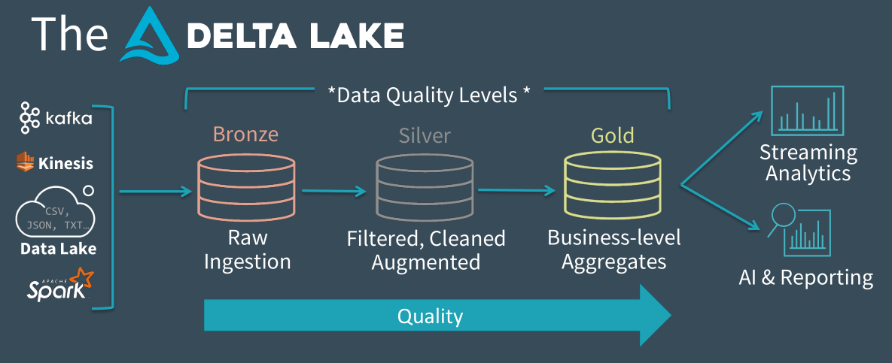

# Data warehousing with Hive

## OLAP vs OLTP

- **OLAP**: OnLine Analytical Processing
  - Process billions of rows in ETL (Extract Transform Load) batch pipelines
  - Join multiple tables
- **OLTP**: OnLine Transactional Processing
  - Read/insert/update a few values the fastest possible

## Apache Hive

- Query data on HDFS using **SQL like language**: HiveQL
- Converts **HiveQL to a DAG of jobs** on YARN
- Works with multiple execution frameworks:
  - MapReduce: disk I/O intensive
  - Tez: uses RAM and can chain reduces
  - (Spark)

## Query data on HDFS

- Enables to query data **already** on HDFS
- Supports **multiple file formats**:
  - Readable semi-structured (CSV, JSON…)
  - Optimized file format (**ORC**, Parquet, Avro)
- Can also read data from other systems : HBase, Kafka, PostgreSQL, etc.

## Data file formats

- **Columnar** file formats:
  - Split and compressed by column (binary formats)
  - Embedded statistics on data
  - Embedded schema
  - Exemples: Apache ORC, Apache Parquet
- Exchange file formats: Apache Avro, Protocol Buffers

## Hive components

- **HiveServer**
  - Translates HQL to Tez or MR jobs
- **Hive Metastore** (stores data in RDBMS)
  - Stores metadata (table names, schema, data location)
  - Stores statistics on the tables
- **Hive clients** (JDBC). E.g. Beeline

## Example: daily ingestion of CSV file

- Everyday a new CSV file is added on HDFS
- An external Hive table is created to be able to query it
  - It points to the folder where the CSV data is
  - CSV can already be queries, but it’s not optimal
- We create another Hive table, stored as ORC instead
  - Stored in another HDFS folder
  - We ingest the CSV data from the first table to this one

## Hive partitions

- Tables can (**should**) be organized in partitions
  - Divide a table into related parts based on the values of particular columns (e.g. date, country, etc.)
  - Enables to query parts of the data (avoid full scan)
  - There should not be to many (small files problem)
  - 1 partition = 1 subfolder in HDFS
    - `.../products_table/p_type=book/orc_data`

## Bronze/silver/gold paradigm

## To go further

- Views
  - Hive 3: materialized views
- Hive LLAP
  - Caching mechanism for faster queries
  - Useful for BI tools and Apache Druid
